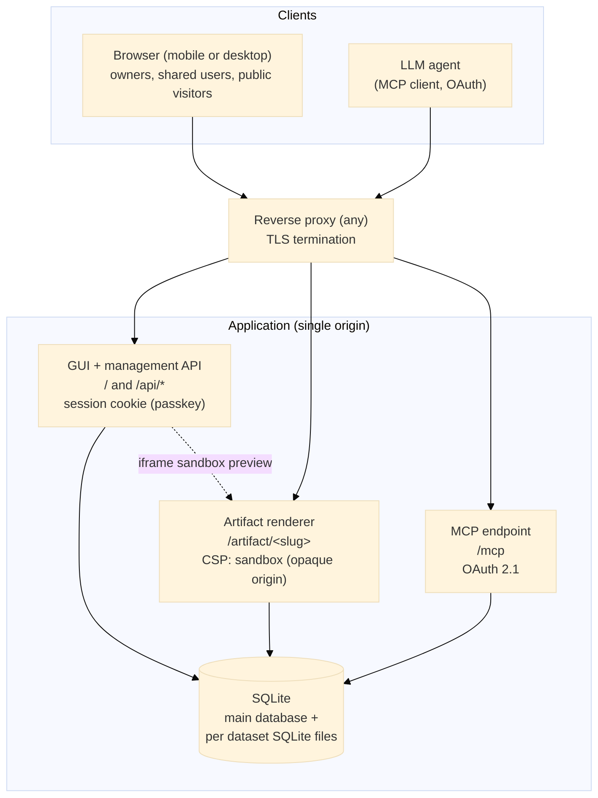

# Artivault: Design Specification

Artivault is a self-hosted, open source service to store, view, edit and version AI generated artifacts (and their datasets), reachable from mobile, kept private behind application authentication (with an optional public mode per artifact), and writable by an LLM agent through an MCP endpoint.

- Status: design draft (no implementation yet)
- Intended license: open source
- Name: Artivault

## 1. Purpose

Artifacts produced by an assistant such as Claude usually live only inside the desktop client. This service externalizes them to a self-hosted application so they can be consulted and edited from any device through a browser, while remaining private by default. Two hard requirements shape the design:

1. Content is private by default. Access is guarded by application authentication, not by the network. An artifact can optionally be made public.
2. The agent (an LLM such as Claude, or any MCP client) edits the artifacts and their datasets through an MCP endpoint.

## 2. Scope

In scope: hosting and rendering of self contained HTML, SVG and rendered Markdown artifacts; associated datasets; multi user accounts with admin and user roles; per resource sharing in read or write; an optional public mode per artifact; passkey authentication; an MCP endpoint for read and write; full versioning of artifacts and datasets; collaborative editing protected by a lock.

Out of scope for this version: real time simultaneous co editing (collaboration is serialized by a lock), server side generation of artifacts, and server side execution of artifact code (artifacts run in the browser only).

## 3. Key decisions (resolved)

- Stack: TypeScript and Node.
- Single domain, path based routing. No dedicated subdomains for rendering or MCP.
  - `/` and `/api/...` : GUI and management API.
  - `/mcp` : MCP endpoint.
  - `/artifact/<random-slug>` : artifact rendering. The absolute URL is returned to the agent so it can pass it to the user.
- MCP authentication: full OAuth 2.1.
- Agent identity: the agent acts under the authorizing user's own account (no dedicated service account).
- Artifact content storage: in the SQLite database.
- CDN policy: unrestricted for now (the render CSP does not constrain external script or style origins yet).
- Artifact kinds: HTML, SVG, rendered Markdown. Markdown is rendered to HTML on the server.
- Dataset storage: CSV or a per dataset SQLite database, chosen by size. No size limit for now.
- Admin can list everyone's artifacts (metadata) but cannot read their content.
- Versioning: unlimited number of versions, individual versions can be deleted.
- Sharing: read or write. Write enables collaboration, so a lock system is required.
- Public artifacts: an artifact can be made public, reachable without authentication through its unguessable render URL.

## 4. Architecture overview

A single application, one origin, one container. All roles are served from the same domain over paths.

The service is deployment agnostic: it sits behind any reverse proxy that terminates TLS and forwards a single upstream. Privacy comes from the application's authentication, not from network placement.

## 5. URL layout

| Path | Purpose | Auth |
|---|---|---|
| `/` | GUI (single page or server rendered) | Session cookie (passkey) |
| `/api/*` | Management REST API | Session cookie + CSRF token |
| `/artifact/<slug>` | Artifact rendering, isolated | Private: session cookie on the top level navigation. Public: none. Sandboxed in all cases |
| `/api/render-data/<capability-token>` | Data access for a sandboxed artifact | Capability token (not cookie) |
| `/mcp` | MCP endpoint (Streamable HTTP) | OAuth 2.1 bearer |
| `/oauth/*`, `/.well-known/oauth-authorization-server` | OAuth authorization server for MCP | Public discovery + user login |

The `<slug>` is a server generated, unguessable, URL safe identifier (for example a 22 character base62 string). For a private artifact it prevents enumeration but is not by itself an access grant: rendering still requires an authenticated session and a permission check. For a public artifact the slug is the capability: anyone holding the link can render it without authentication.

## 6. Data model (SQLite)

- `users` : id, email, display_name, role (admin or user), disabled, created_at.
- `credentials` : id, user_id, credential_id, public_key, counter, transports, device_name, created_at, last_used_at (one passkey per device).
- `artifacts` : id, owner_id, slug, name, kind (html, svg, markdown), content, visibility (private or public), published_at, published_by, current_version, created_at, updated_at.
- `artifact_versions` : id, artifact_id, version, content, editor_id, editor_kind (user or agent), note, created_at.
- `datasets` : id, owner_id, slug, name, storage (inline or sqlite_file), format (csv, json, sqlite), content (nullable, for inline), file_path (nullable, for sqlite_file), current_version, created_at, updated_at.
- `dataset_versions` : id, dataset_id, version, content (nullable), file_path (nullable), editor_id, editor_kind, note, created_at.
- `artifact_datasets` : artifact_id, dataset_id (link table; sharing or publishing an artifact propagates access to its linked datasets).
- `shares` : id, resource_kind (artifact or dataset), resource_id, grantee_id, permission (read or write), created_by, created_at.
- `locks` : id, resource_kind, resource_id (unique active per resource), holder_id, holder_kind (user or agent), acquired_at, expires_at.
- `sessions` : id, user_id, user_agent, created_at, expires_at (server side, so sessions can be revoked).
- `oauth_clients` : id, client_id, client_name, redirect_uris, created_at (dynamic client registration).
- `oauth_tokens` : id, user_id, client_id, access_token_hash, refresh_token_hash, scopes, expires_at, created_at.
- `audit_log` : id, actor_id, actor_kind (user or agent), action, resource_kind, resource_id, ip, detail, at.

Artifact content is stored inline in the database. A dataset is stored either inline (CSV or JSON text, for small sets) or as its own SQLite file referenced by `file_path` (for large sets). There is no size limit for now.

## 7. Roles and permissions (admin and user)

Two global roles.

- `user` : full control over the resources they own (create, read, update, delete, share, publish, manage versions and links). Can edit resources shared with them in write. Can view and render resources shared with them in read.
- `admin` : account and system administration. Can create users, set roles, disable accounts, and manage the OAuth clients and the audit log. Can list every user's artifacts and datasets as metadata (name, owner, timestamps, versions, visibility). Cannot read the content of resources they do not own or that are not shared with them, and cannot render them. Administration never grants content access.

Permission matrix:

| Action | Owner | Shared read | Shared write | Admin |
|---|---|---|---|---|
| List (metadata) | Yes | Yes | Yes | Yes (all users) |
| View content and render | Yes | Yes | Yes | No (unless owner or shared) |
| Edit and create versions | Yes | No | Yes (with lock) | No |
| Delete resource | Yes | No | No | No |
| Delete a version | Yes | No | Yes (with lock) | No |
| Share and unshare | Yes | No | No | No |
| Make public or private | Yes | No | No | No |
| Manage accounts and system | No | No | No | Yes |

## 8. Sharing and collaboration

Sharing is per resource and per grantee, at one of two levels:

- read : the grantee can view and render the resource.
- write : the grantee can also edit it and manage its versions, subject to the lock.

Sharing an artifact propagates the same permission level to its linked datasets, so shared collaborators get the data that the artifact needs. Only the owner can share, change a grantee's level, or revoke.

Because write can be granted to several users, and because the agent can also write, concurrent edits are serialized by a lock:

- Acquire: a writer (user or agent) acquires an exclusive lock on the resource before editing. The lock records the holder and an expiry. Default TTL is 5 minutes.
- Hold and refresh: the GUI and the agent send a heartbeat every 60 seconds while editing to extend the lock. A lock with no heartbeat within the TTL is considered free.
- Release: the lock is released explicitly on save or close, or automatically on expiry.
- Contention: while a resource is locked by someone else, other writers see it read only and are told who holds the lock and until when. The owner and an admin can force release.
- Optimistic safety net: every save also carries the base version number. If it no longer matches the current version, the save is rejected even if a lock was obtained, which protects against stale writes.

The MCP write tools follow the same rules (see section 14).

## 9. Versioning

Every artifact and every dataset is versioned. Each successful edit creates a new immutable version with its editor, editor kind (user or agent), an optional note, and a timestamp. `current_version` points at the head.

- No limit on the number of versions retained.
- Any individual version can be deleted (except the current head, which is deleted by first restoring or replacing it), by the owner or a write collaborator.
- Restore promotes a past version to a new head version (history is append only, restore does not erase).
- For inline datasets, a version stores the CSV or JSON snapshot. For SQLite file datasets, every version is a full file snapshot referenced by path, and deleting a version deletes its snapshot file. Full snapshots are chosen for simplicity and integrity, at the cost of disk space under unlimited retention.

## 10. Authentication (passkeys)

- Passwordless authentication with WebAuthn passkeys (SimpleWebAuthn on server and browser).
- The Relying Party ID is the single deployment domain. With one origin there is no subdomain ambiguity: the passkey is bound to that domain.
- Behind a reverse proxy, `rpID` and the expected origin must be configured explicitly to the public domain and the forwarded headers trusted, otherwise verification resolves to the internal host and fails.
- Sessions are server side and carried by an HttpOnly, Secure cookie. Write endpoints are additionally protected by a CSRF token (double submit), since untrusted artifact content is served from the same origin (see section 11).
- Bootstrap: the first registered account becomes admin.
- Users can register several passkeys (one per device) and manage or revoke them.

## 11. Artifact rendering and isolation

Artifacts contain arbitrary JavaScript. On a single origin they must not be able to reach the authenticated session or the management API. Isolation is enforced without a separate domain:

- `GET /artifact/<slug>` serves the artifact document with the response header `Content-Security-Policy: sandbox allow-scripts allow-forms allow-popups` (no `allow-same-origin`). This places the document in an opaque origin, so its scripts cannot read cookies or localStorage of the application origin, and cannot make credentialed same origin calls to `/api`.
- Access control on that route depends on visibility. For a private artifact, the route authenticates the top level navigation with the session cookie (a top level GET carries the cookie) and checks the caller's permission. For a public artifact, no authentication is required and the unguessable slug is the access grant. The sandbox isolation applies in both cases, which also protects a logged in user who opens a public artifact on the same origin.
- The GUI shows previews inside an `iframe sandbox="allow-scripts"` pointing at the same route, adding a second layer of isolation.
- Markdown artifacts are rendered on the server: the source is stored as Markdown, converted to HTML server side, and the resulting HTML is served through the same sandboxed render path. HTML and SVG artifacts are served as authored.
- Data access from a sandboxed artifact cannot rely on the session cookie (the document is opaque origin). Instead, at render time the server mints short lived capability tokens for the datasets linked to the artifact and injects their access URLs (`/api/render-data/<token>`) into the returned document. The token is bound to the render context, the artifact and the specific dataset, and expires quickly. This decouples data access from the session and keeps write access impossible from the rendered document. For a public artifact, the same mechanism applies without a session, so its linked datasets are readable through it.
- Write endpoints stay protected by both the opaque origin isolation and CSRF tokens.

CDN usage inside artifacts is unrestricted for now, so the sandbox CSP does not constrain script or style source origins at this stage. Tightening the CSP is a later hardening step.

## 12. Datasets

A dataset is CSV, JSON, or a SQLite database, and is either inline (small) or a per dataset SQLite file (large), chosen by size. No limit for now.

- Inline datasets are returned whole to an authorized artifact through the capability data URL.
- SQLite file datasets are exposed through a server side read only SQL endpoint reached with the capability token: the artifact sends a SELECT and receives only the result rows as JSON, so large data is never downloaded whole. The database is opened read only (`query_only`), with a statement timeout and a cap on returned rows and bytes. This is chosen for efficiency, minimizing both transfer and client work. Writes to datasets go only through the management API or MCP, never from a rendered artifact.
- Datasets are versioned like artifacts (section 9) and are shared implicitly with the artifacts that link them (section 8). Making an artifact public also exposes its linked datasets for public read through that artifact, which the GUI states clearly when publishing.

## 13. GUI

A responsive web interface, usable on mobile, covering:

- Authentication: passkey registration and login, and management of the user's passkeys and devices.
- Dashboard: the resources the user owns and those shared with them, for both artifacts and datasets, with search and filtering, showing owner, kind or format, current version, share state, visibility (private or public), and lock state.
- Editor: a code editor for the artifact source with a live preview in a sandboxed iframe, a selector for the kind (HTML, SVG, Markdown), management of linked datasets, a visible lock indicator (who is editing and until when), and the version history with view, restore and delete.
- Dataset editor: create and edit inline datasets, upload or replace SQLite file datasets, and browse dataset versions.
- Sharing and visibility panel: grant, change or revoke read or write access to specific users for a resource, with the reminder that sharing an artifact also shares its linked datasets. It also carries a public toggle to publish or unpublish an artifact, with a clear warning that a public artifact and its linked datasets become reachable by anyone holding the link without authentication, and an option to regenerate the slug to revoke old public links.
- Account settings: passkeys, and the authorized MCP OAuth clients with the ability to revoke them.
- Admin area (admin role only): user management (create, set role, disable), a global metadata only listing of all users' artifacts and datasets (no content), OAuth client management, and the audit log.

## 14. MCP endpoint and tools

- Transport: Streamable HTTP at `/mcp`, using the official MCP SDK.
- Authentication: OAuth 2.1, including an authorization server on the same origin (`/oauth/authorize`, `/oauth/token`, dynamic client registration at `/oauth/register`, and discovery at `/.well-known/oauth-authorization-server`). The user logs in with their passkey during the OAuth flow and authorizes the client. The issued token is bound to that user's account, so every tool runs with that user's permissions.
- Returned URLs: tools that create or return an artifact include its absolute render URL (`<PUBLIC_BASE_URL>/artifact/<slug>`), so the agent can hand the link to the user. For a public artifact the link opens without authentication. Dataset tools likewise return stable references.
- Locking: write tools acquire the resource lock implicitly (they fail with a clear error if another holder has it), create a new version, and release, all in one call. For longer agent driven editing sessions, explicit `acquire_lock` and `release_lock` tools are available. The optimistic version check of section 8 also applies.

Tools (names indicative):

- Artifacts: `list_artifacts`, `get_artifact` (content, url, visibility, current version, lock state), `create_artifact` (returns url), `update_artifact` (auto lock, new version), `set_artifact_visibility` (public or private), `delete_artifact`, `list_artifact_versions`, `restore_artifact_version`, `delete_artifact_version`.
- Datasets: `list_datasets`, `get_dataset`, `create_dataset`, `update_dataset`, `delete_dataset`, `query_dataset` (read only, for SQLite datasets), `list_dataset_versions`, `restore_dataset_version`, `delete_dataset_version`.
- Links and sharing: `link_dataset`, `unlink_dataset`, `share_artifact`, `unshare_artifact`, `share_dataset`, `unshare_dataset`.
- Locks: `acquire_lock`, `release_lock`.

Every write is recorded in the audit log with `actor_kind = agent` and the acting user.

## 15. Management API (summary)

Session and CSRF protected REST under `/api`, mirroring the GUI and the MCP capabilities:

- Auth: `/api/auth/register/*`, `/api/auth/login/*`, `/api/auth/logout`, `/api/auth/passkeys`.
- Artifacts: CRUD under `/api/artifacts`, plus `/versions`, `/versions/:v/restore`, `/versions/:v` (delete), `/lock` (acquire, refresh, release), `/shares`, `/visibility` (publish or unpublish, regenerate slug), and `/datasets` (link, unlink).
- Datasets: the same shape under `/api/datasets`, plus dataset content upload for SQLite files.
- Rendering data: `/api/render-data/<capability-token>`.
- Admin: `/api/admin/users`, `/api/admin/artifacts` (metadata), `/api/admin/audit`, OAuth client management.

## 16. Deployment

- A single container (Node) serving all paths on one port, behind any TLS terminating reverse proxy.
- A data volume holds the main SQLite database and the per dataset SQLite files.
- Configuration by environment: the public base URL and expected origin, the Relying Party ID, cookie and token signing secrets, and OAuth settings.
- Backups: the SQLite database and the dataset files should be captured by the operator's backup solution. Use a consistent SQLite snapshot (online backup) before archiving to avoid copying a file mid write.

## 17. Technical stack

Node LTS with TypeScript in ES modules, a lightweight HTTP framework, better-sqlite3, SimpleWebAuthn (server and browser), the official MCP SDK, a JWT library for capability tokens, a Markdown to HTML renderer, and schema validation. Deliberately lightweight so it runs comfortably on modest self hosted hardware.

## 18. Decided items (log)

1. MCP authentication: full OAuth 2.1.
2. Agent identity: the authorizing user's own account.
3. Artifact content storage: in the SQLite database.
4. CDN policy: unrestricted for now.
5. Artifact kinds: HTML, SVG, rendered Markdown (Markdown rendered to HTML on the server).
6. Dataset storage: CSV or per dataset SQLite by size, no limit for now.
7. Admin: may list others' artifacts (metadata) but cannot read their content.
8. Versioning: unlimited versions, individual versions deletable.
9. Relying Party ID: the single deployment domain (the earlier subdomain versus parent question no longer applies with one origin).
10. Sharing: read or write, with a lock system for collaborative editing.
11. Public mode: an artifact can be published for unauthenticated access through its unguessable URL, which also exposes its linked datasets.

## 19. Implementation details (resolved) and remaining open item

Resolved:
- Large SQLite dataset versions are stored as full file snapshots.
- SQLite file datasets are queried through a server side read only SQL endpoint that returns only result rows, chosen for efficiency.
- Lock defaults: 5 minute TTL, 60 second heartbeat refresh, automatic expiry when the heartbeat stops, and force release by the owner or an admin.
- Markdown artifacts are rendered on the server to HTML.

Still open:
- CSP hardening plan for a later version, once CDN needs are known.
